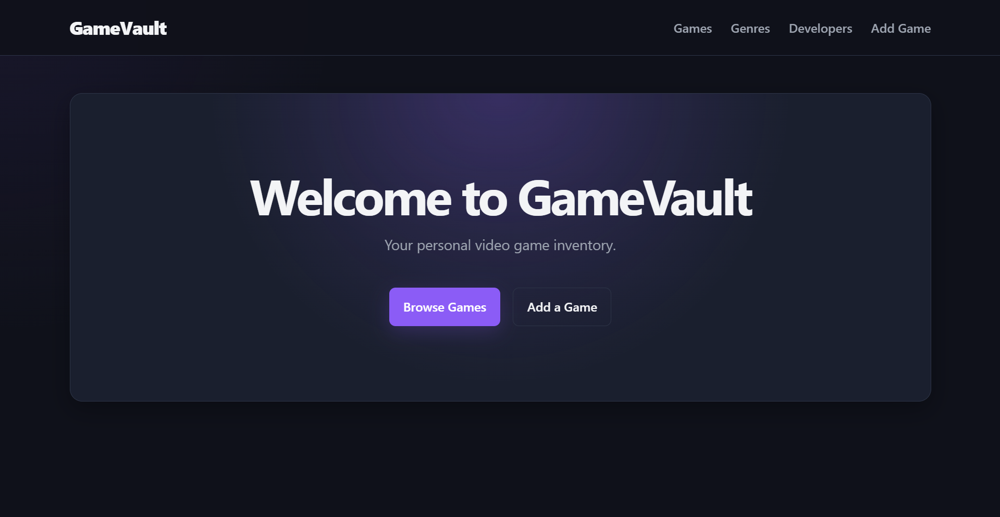
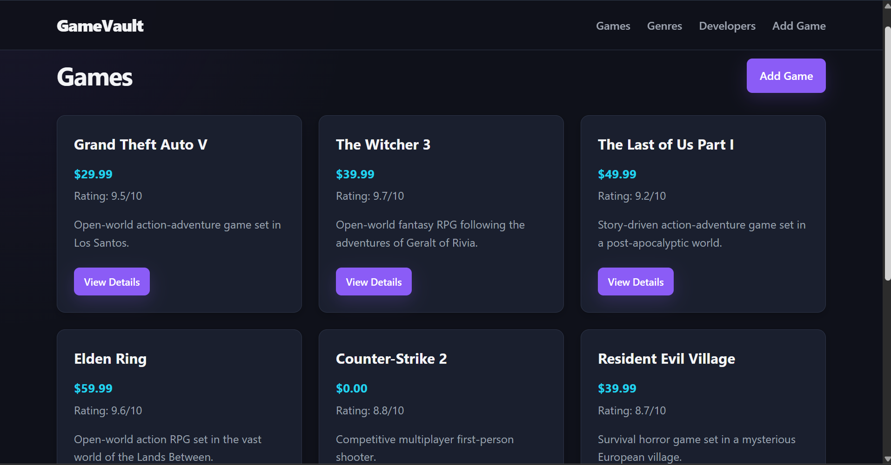
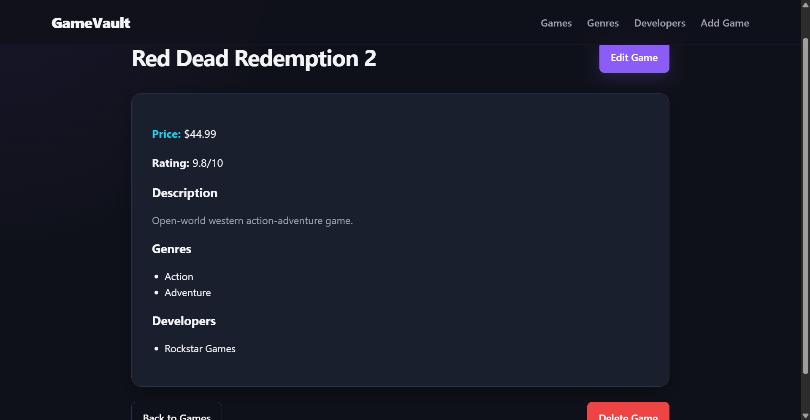
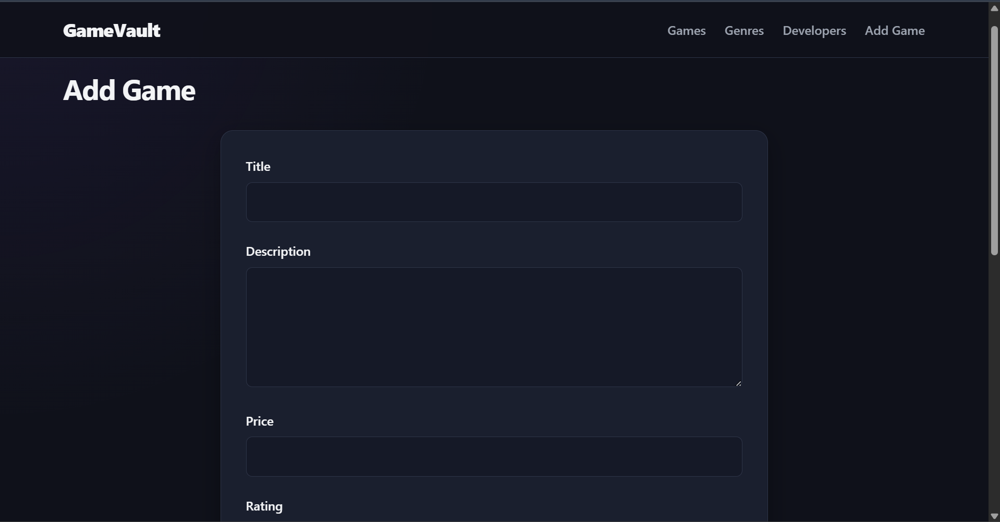

# GameVault

GameVault is a full-stack game inventory management application built with Node.js, Express, EJS, and PostgreSQL. It allows users to browse games, view detailed game information, and manage games, genres, and developers through a database-backed interface.

The application follows an MVC-style structure, uses server-side rendering with EJS, and stores persistent data in PostgreSQL. Games can be associated with multiple genres and developers through many-to-many relationships.

## Live Demo

**Live:** https://game-vault.bonto.run/

## Screenshots









## Features

* Browse all games in the inventory
* View detailed information about individual games
* Create, update, and delete games
* Create, update, and delete genres
* Create, update, and delete developers
* View games associated with a specific genre
* View games associated with a specific developer
* Assign multiple genres to a game
* Assign multiple developers to a game
* Many-to-many relationships between games and genres
* Many-to-many relationships between games and developers
* Persistent data storage using PostgreSQL
* Server-side rendering with EJS
* Reusable EJS navbar partial
* Server-side form validation using express-validator
* Validation error messages displayed within forms
* Custom 404 error handling for invalid routes and resources
* Parameterized PostgreSQL queries
* Database cascade behavior for related junction records
* Responsive gaming-focused interface
* Interactive hover and focus states
* Responsive navigation and forms
* Dark-themed UI with purple, blue, and cyan accents
* CSS custom properties for reusable styling values
* Deployed Node.js application connected to a production PostgreSQL database

## Built With

* Node.js
* Express
* EJS
* PostgreSQL
* pg
* express-validator
* JavaScript
* HTML5
* CSS3
* Bonto
* Neon PostgreSQL

## Database Design

GameVault uses five PostgreSQL tables to represent games and their relationships with genres and developers.

### Tables

#### `games`

Stores the main information for each game.

* `id`
* `title`
* `description`
* `price`
* `rating`

#### `genres`

Stores the available game genres.

* `id`
* `name`

#### `developers`

Stores game developers.

* `id`
* `name`

#### `games_genres`

Junction table connecting games and genres.

* `game_id`
* `genre_id`

#### `games_developers`

Junction table connecting games and developers.

* `game_id`
* `developer_id`

### Relationships

Games and genres have a many-to-many relationship:

```text
Game ─────< games_genres >───── Genre
```

A game can belong to multiple genres, while a genre can contain multiple games.

Games and developers also have a many-to-many relationship:

```text
Game ─────< games_developers >───── Developer
```

A game can have multiple developers, while a developer can be associated with multiple games.

The junction tables use composite primary keys to prevent duplicate relationships.

Foreign keys use `ON DELETE CASCADE` so that when a game is deleted, its related junction-table records are automatically removed.

Deleting a genre or developer only removes its corresponding relationship records; it does not delete the associated games.

## What I Learned

This project helped me practice and reinforce:

* Building a complete Express application
* Structuring a larger Express project
* Organizing routes using Express Routers
* Separating route handling into controllers
* Understanding and applying the MVC pattern
* Rendering dynamic pages with EJS
* Passing data from controllers to EJS templates
* Creating reusable EJS partials
* Working with dynamic routes and route parameters
* Handling form submissions with `req.body`
* Parsing URL-encoded form data with `express.urlencoded()`
* Serving static assets with `express.static()`
* Handling redirects with `res.redirect()`
* Creating custom error classes
* Throwing custom errors from controllers
* Creating Express error-handling middleware
* Using HTTP status codes appropriately
* Building CRUD functionality
* Creating database-backed forms
* Updating existing database records
* Deleting database records
* Implementing server-side form validation with express-validator
* Preserving submitted form data after validation errors
* Displaying validation errors in EJS views
* Working with PostgreSQL from Node.js using `pg`
* Creating PostgreSQL connection pools
* Executing parameterized SQL queries
* Preventing SQL injection through parameterized queries
* Separating database queries from controllers
* Designing relational database schemas
* Creating primary and foreign key relationships
* Implementing many-to-many relationships
* Designing and using junction tables
* Using composite primary keys
* Using foreign key cascade behavior
* Creating and populating database tables
* Seeding a PostgreSQL database with initial data
* Using environment variables for database configuration
* Separating local and production database environments
* Connecting a deployed Node.js application to a production PostgreSQL database
* Deploying an Express application
* Structuring responsive layouts with CSS
* Using Flexbox and CSS Grid
* Using CSS custom properties
* Creating responsive forms and navigation
* Building interactive hover and focus states
* Designing a consistent UI across multiple pages

## Project Structure

```text
inventory-application/
├── controllers/
│   ├── developersController.js
│   ├── gamesController.js
│   ├── genresController.js
│   └── indexController.js
├── db/
│   ├── pool.js
│   ├── populatedb.js
│   └── queries.js
├── errors/
│   └── CustomNotFoundError.js
├── public/
│   └── styles.css
├── routes/
│   ├── developersRouter.js
│   ├── gamesRouter.js
│   ├── genresRouter.js
│   └── indexRouter.js
├── views/
│   ├── partials/
│   │   └── navbar.ejs
│   ├── 404.ejs
│   ├── createDeveloper.ejs
│   ├── createGame.ejs
│   ├── createGenre.ejs
│   ├── developer.ejs
│   ├── developers.ejs
│   ├── game.ejs
│   ├── games.ejs
│   ├── genre.ejs
│   ├── genres.ejs
│   ├── index.ejs
│   ├── updateDeveloper.ejs
│   ├── updateGame.ejs
│   └── updateGenre.ejs
├── app.js
├── package.json
├── .gitignore
└── README.md
```

## Installation

Clone the repository:

```bash
git clone https://github.com/abdullahrashid359/inventory-application.git
```

Navigate to the project directory:

```bash
cd inventory-application
```

Install dependencies:

```bash
npm install
```

Create a `.env` file in the project root and add your PostgreSQL connection string:

```env
DATABASE_URL=your_postgresql_connection_string
```

Populate the database:

```bash
node db/populatedb.js
```

Start the application:

```bash
node app.js
```

For development with automatic restarting:

```bash
node --watch app.js
```

Open the application in your browser:

```text
http://localhost:3000
```

## Routes

### General

| Method | Route | Description                      |
| ------ | ----- | -------------------------------- |
| GET    | `/`   | Displays the GameVault home page |

### Games

| Method | Route               | Description                   |
| ------ | ------------------- | ----------------------------- |
| GET    | `/games`            | Displays all games            |
| GET    | `/games/new`        | Displays the create-game form |
| POST   | `/games/new`        | Creates a new game            |
| GET    | `/games/:id`        | Displays a specific game      |
| GET    | `/games/:id/edit`   | Displays the edit-game form   |
| POST   | `/games/:id/edit`   | Updates a game                |
| POST   | `/games/:id/delete` | Deletes a game                |

### Genres

| Method | Route                | Description                               |
| ------ | -------------------- | ----------------------------------------- |
| GET    | `/genres`            | Displays all genres                       |
| GET    | `/genres/new`        | Displays the create-genre form            |
| POST   | `/genres/new`        | Creates a new genre                       |
| GET    | `/genres/:id`        | Displays a genre and its associated games |
| GET    | `/genres/:id/edit`   | Displays the edit-genre form              |
| POST   | `/genres/:id/edit`   | Updates a genre                           |
| POST   | `/genres/:id/delete` | Deletes a genre                           |

### Developers

| Method | Route                    | Description                                   |
| ------ | ------------------------ | --------------------------------------------- |
| GET    | `/developers`            | Displays all developers                       |
| GET    | `/developers/new`        | Displays the create-developer form            |
| POST   | `/developers/new`        | Creates a new developer                       |
| GET    | `/developers/:id`        | Displays a developer and its associated games |
| GET    | `/developers/:id/edit`   | Displays the edit-developer form              |
| POST   | `/developers/:id/edit`   | Updates a developer                           |
| POST   | `/developers/:id/delete` | Deletes a developer                           |

## Validation

GameVault uses `express-validator` to perform server-side validation before modifying the database.

Games validate:

* Title is required
* Title must not exceed 100 characters
* Description is optional
* Description must not exceed 250 characters
* Price is required
* Price must be a valid number greater than or equal to 0
* Rating is required
* Rating must be a number between 0 and 10

Genres and developers validate:

* Name is required
* Name must not exceed 100 characters

Validation errors are displayed on the corresponding forms while preserving the submitted form data so users can correct individual fields without losing their input.

## Error Handling

GameVault uses a custom `CustomNotFoundError` class for resources and routes that do not exist.

For example, requesting a game with an invalid ID results in a custom 404 response rather than allowing the application to continue with an undefined resource.

Express error-handling middleware catches application errors and renders the custom 404 page for not-found errors. Unexpected errors are returned with a 500 status code.

## Database Queries

Database operations are separated from controllers into `db/queries.js`.

This keeps database-specific logic separate from request-handling logic and makes the controllers responsible primarily for:

1. Receiving the request
2. Calling the appropriate database operation
3. Preparing data for the view
4. Rendering or redirecting the response

All user-provided values used in SQL queries are passed through PostgreSQL parameterized queries rather than being directly interpolated into SQL statements.

For example:

```js
await pool.query(
    "SELECT * FROM games WHERE id = $1",
    [id]
);
```

This provides protection against SQL injection and keeps database access organized.

## Environment Variables

The application uses the `DATABASE_URL` environment variable to configure the PostgreSQL connection.

For local development, the value is stored in a `.env` file:

```env
DATABASE_URL=your_postgresql_connection_string
```

The `.env` file is excluded from version control through `.gitignore`.

In production, the database connection string is supplied through the hosting platform's environment variables rather than being committed to the repository.

## Deployment

The application is deployed as a Node.js/Express application using Bonto.

The production application connects to a separate Neon PostgreSQL database through the `DATABASE_URL` environment variable.

The production environment uses:

```text
NODE_ENV=production
```

The deployed application is available at:

```text
https://game-vault.bonto.run/
```

The local and production databases are kept separate so that development and testing do not modify production data.

## Future Improvements

Possible future improvements include:

* Admin authentication for destructive actions
* Search and filtering functionality
* Sorting games by price, rating, genre, or developer
* Pagination for larger inventories
* Image support for games
* Cover art and screenshots
* User accounts and personalized game collections
* Flash messages for successful actions
* More advanced database transactions for multi-table updates
* Improved duplicate handling for genres and developers
* Additional database constraints and indexes

## Acknowledgements

This project was completed as part of **The Odin Project** NodeJS course in the Full Stack JavaScript Path.

[The Odin Project – Inventory Application](https://www.theodinproject.com/lessons/node-path-nodejs-inventory-application)